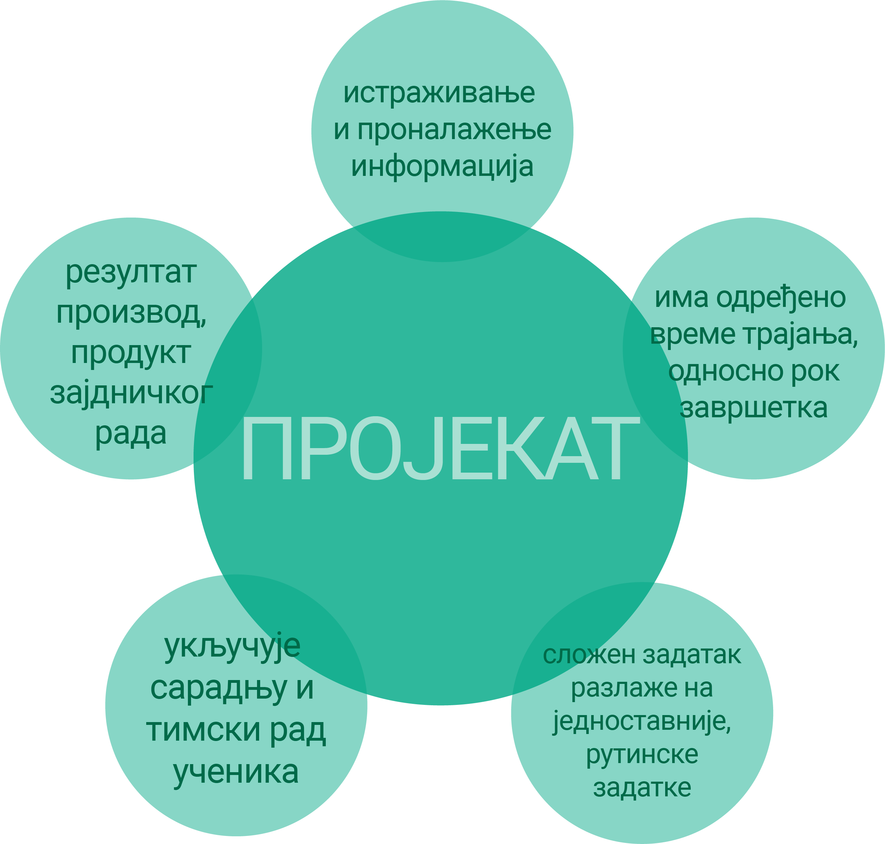

Пројектна настава
=================

Да би практично применио/ла стечена знања из области Информационо-комуникационе технологије и Дигиталне писмености, у оквиру наредних лекција радићеш на истраживачком пројекту заједно са својим друговима из одељења. 
У оквиру овог пројекта потребно је да препознаш реалне животне ситуације у којима можеш да примениш усвојена знања и стечене вештине из претходних лекција. 
Током рада на истраживачком пројекту можеш да користиш интернет, али можеш додатне информације да пронађеш у уџбеницима и књигама из библиотеке.

Дошло је време да након изучавања тема Информационо-комуникационе технологије и Дигитална писменост, покажеш шта знаш. 
Током наредна три часа заједно са својим друговима и другарицама из одељења, бавићеш се израдом истраживачког школског пројекта. Приликом рада на изради пројекта потребно је да се позабавите реалним животим ситуацијама у којима можете да примените усвојена знања и стечене вештине из претходних лекција. Током рада на истраживачком пројекту као извор информација користићете интернет, књиге, уџбенике и питаћете наставнике и родитеље.

**Шта је пројекат?**

Пројекат представља скуп активности које се реализују у одређеном временском  периода у циљу остваривања претходно дефинисаног циља (решења постављеног животног проблема) уз ангажовање одређених људи. Тачније, пројекат треба да одговори на питање шта треба да спроведемо како бисмо дошли до решења постављеног проблема. 
 

Пројекат је сложена активност која садржи више фаза и траје одређено време.

Пројекат најчешће подразумева детаљан опис следећих аспеката:

-  описа ситуације тј. проблема који треба да се реши или ублажи реализацијом пројекта, односно којом темом треба да се бавимо да бисмо решили неки животни проблем. На пример: Дигитално насиље – да ли га има у школама? 

-  дефинисање циљева пројекта који представљају, после дефинисања проблема, једну од најважнијих ставки. Код дефинисања циљева они морају да буду у потпуности испуњени. Треба га дефинисати на нивоу на ком је могуће проверити да ли се предвиђене промене и побољшања дешавају и да ли је жељена ситуација ближа него пре почетка пројекта. Циљем треба да се опише будућа промењена ситуација или стање које конкретан пројекат тежи да достигне. Дакле, циљеве треба писати по СМАРТ принципу, односно тако да буду јасни, мерљиви, остварљиви, реални и временски одређени. 

.. image:: ../../_images/smart.png
     :align: center
     :width: 600px

На пример: Подизање свести о постојању дигиталног насиља у школама креирањем процедура које се спроводе уколико до насиља дође.

-  активности и њихов временски распоред – Дефинише се конкретни задаци, начин и временски оквир реалиазације пројекта.
     
-  очекивани резултати - Оно што је јако важно приликом реализације сваког пројекта да је рад на њему изазован и да се добијени резултати или решења могу применути у свакодневном животу. Наравно да приликом тога тема, обим и дубина проучавања мора бити примерена годинама ученика
     
-  презентовање/представљање пројекта - дефинише се шта ће бити продукти истраживачког пројекта и на који ће начин они бити презентовани и коме.
