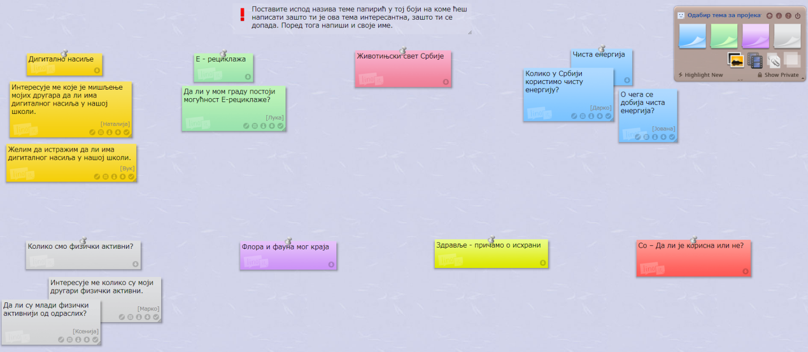
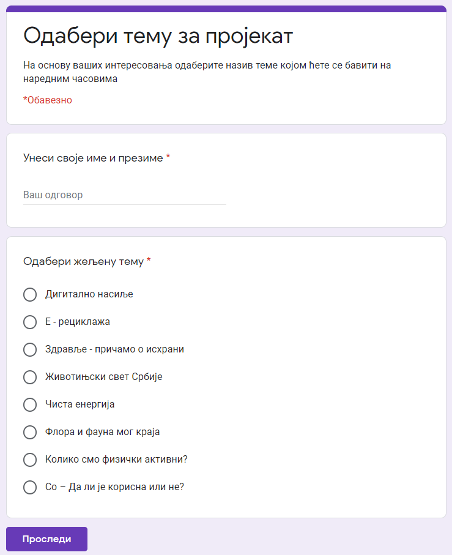

Одабир теме и сарадника
========================

За почетак, пред тобом и твојим друговима и другарицама се налазе прави, животни проблеми које треба да решите, а који произилази из школског градива или ваше потребе за сазнањем, а у чију израду је ангажован ваш креативни ум и са тобом твоји другари. Најбоље теме повезују садржаје који се уче у предмету са актуалним проблемима и потребама средине у којој ученик живи. 

Дошло је време да након изучавања тема Информационо-комуникационе технологије и Дигитална писменост, покажеш шта знаш. 
Током наредних часова заједно са својим друговима и другарицама из одељења, бавићеш се израдом истраживачког школског пројекта. 
Приликом рада на изради пројекта потребно је да се позабавите реалним животим ситуацијама у којима можете да примените усвојена знања и стечене вештине из претходних лекција. Током рада на истраживачком пројекту као извор информација користићете интернет, књиге, уџбенике и питаћете наставнике и родитеље.

Како почети са израдом пројекта? 
Пројекат је сложена активност која садржи више фаза и траје одређено време. Пре почетка рада на самом пројекту, потребно је размотрити следеће:

•	Идеја - шта ће бити наш истраживачки задатак на коме чемо радити;

•	Партнери - ко ће бити сарадници на пројекту са којима ћемо радити у тиму;

•	План тема - одредити конкретније задатке на којима ћемо радити и шта ће бити тема пројекта;

•	План активности - одредити на који начин ћемо радити;

•	План реализације - одредити временску динамику када ћемо реализовати које активности;

•	План програма и алата - одредити које ћемо програме и алате користити за рад;

•	Резултати - одредити шта ће бити продукти које ћемо приказати на крају пројекта.

Радом на пројекту самостално или у тиму, током наредна три часа (или у одређеном дефинисаном временском периоду) истраживаћеш (проналазићеш релевантне информације) и откриваћеш (проналазићеш нове, непознате чињенице) о теми која је теби и твојим друговима и другарицама интересантна, поставићеш решење проблема и на крају ћеш га јавно представити као коначан продукт вашег зајеничког рада.

Оно што је јако важно приликом реализације сваког пројекта да је рад на њему изазован и да се добијени резултати или решења могу применути у свакодневном животу. 

Оно што ћеш на овом часу радити јесте да:

•	размислиш о темама које су излистане и одабереш једну којом ћеш се бавити наредна два школска часа. 
•	пронађеш сараднике – другове и другарице са којима ћеш радити на пројекту. Тачније да формираш тим од сарадника које интересује иста тема као тебе.
•	дефинишеш истраживачки задатак, тачније начине како ћеш да спроведеш истраживање (теоријски или експериментима) и које ресурсе ћеш са својим тимом да користиш.

За тебе смо излистали различите теме које повезују Инфоматику са другим наставним предметима, али и темама из свакодневног живота:

1. Помажемо једни другима

2. Школа је наша

3. Музеј који недостаје

­4. Да ли смо одговорни (Истраживање о ставовима вршњака када је квалитет живота у локалној средини)

5. Дигитални отпад

6. Правилна и безбедна комуникација

Најлакши начин да одабереш тему је да за сваку од њих напишеш зашто ти је интересантна, зашто ти се допада. 
Користи папирне стикере да запишеш своје идеје. Размисли и сваку  идеју постави на засебан папирић. 
У случају да не постоји начин да се уживо одаберете тему, постоји начин да наставник или наставница направи виртуелну таблу на којој ћете постављате стикере са откуцаним идејама.

На доње две слике можеш да видиш два начина одабира тема за истраживачки пројекат.

На првој слици је приказана виртуелна табла за одабир тема, коју је креирао наставник користећи веб алат lino.it.

А на другој слици је приказан онлајн упитник за бирање теме, који је креирао наставник користећи веб алат google forms.

На основу идеја које су написане на стикерима или на основу резултата упитника, можеш лако да одабереш најбоље сараднике за тему коју желиш да радиш. 

Када одабереш тему, врло је лако да формираш тим сарадника 3 до 5 чланова. Тачније, потребно је да формирате тим од сарадника који имају иста интересовања.
Приликом одабира чланова тима не мораш да радиш увек са својим најбољим другом или другарицом, пројекат је активност коју можеш да радиш и са људима који нису из твог окружења, који су чак хиљадама километара од тебе. Једино је важно да имају заједничка интересовање као и ти. 

Када сте одабрали чланове тима, тачније када је формиран тим, први корак је да дефинишеш истраживачки задатак, тачније да дефинишете начине како ћете да спроведете истраживање (теоријски или експериментима) и које ресурсе (интернет, библиотека,...), тачније програме и алатке које ћете алате као тим да користите.

.. infonote::
 
    Сада је ред да ти и твоји другови и другарице:

    - размислите о темама које су излистане и одаберете једну којом ћете се бавити на наредним школским часовима. Користите неки од веб алата за избор теме. У томе нека вам помогне наставник или наставница.
    - формирате тим од сарадника које интересује иста тема на којој ћете радити на наредним школским часовима.
    - дефинишете истраживачки задатак, тачније договорите се како ћете да спроведете истраживање (теоријски или експериментима) и које ћете ресурсе ћете да користите.
