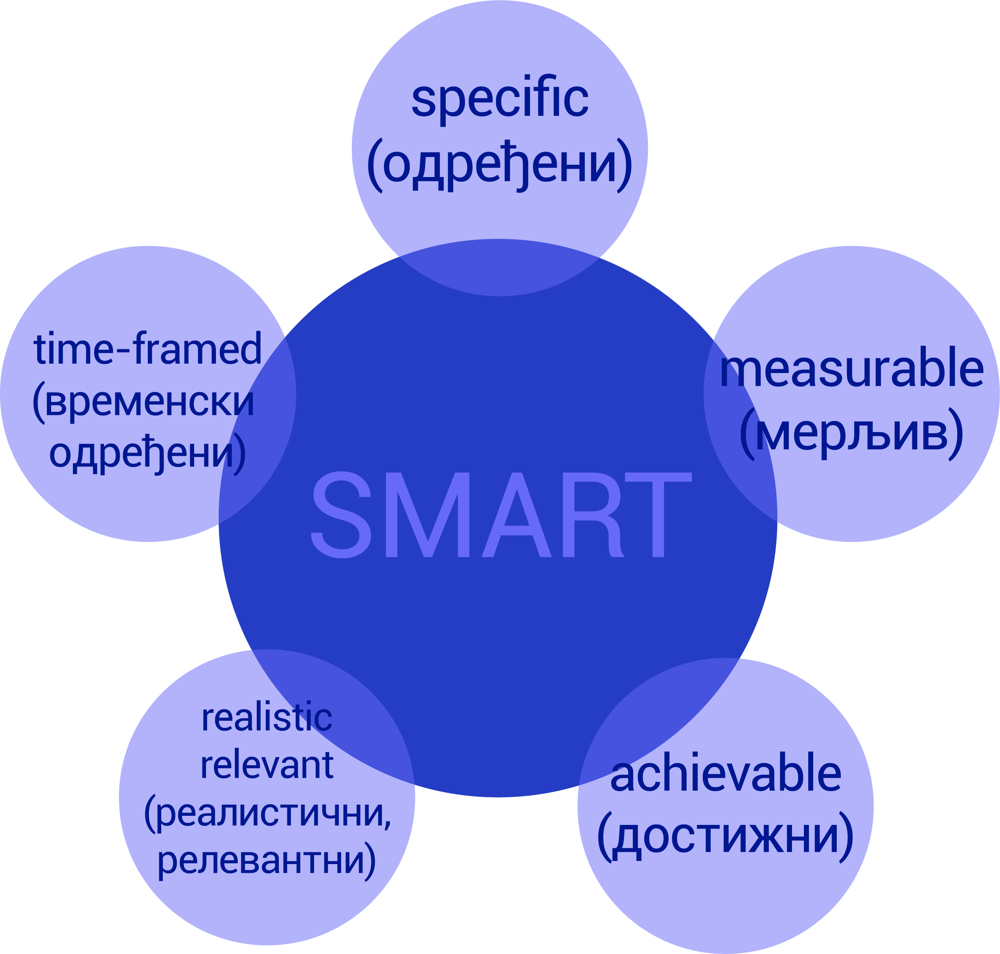

Пројектна настава
=================

Да би практично применио/применила стечена знања из области „Информационо-комуникационе технологије“ и „Дигиталне писмености“, у оквиру наредних лекција радићеш на истраживачком пројекту заједно са својим друговима из одељења. 
У оквиру овог пројекта потребно је да препознаш реалне животне ситуације у којима можеш да примениш усвојена знања и стечене вештине из претходних лекција. 
Током рада на истраживачком пројекту, на наредна три часа, можеш да користиш интернет, али можеш додатне информације да пронађеш у уџбеницима и књигама из библиотеке.

**Шта је пројекат?**

Пројекат представља скуп активности које се реализују у одређеном временском периоду у циљу остваривања претходно дефинисаног циља (решења постављеног животног проблема) уз ангажовање одређених људи. Тачније, пројекат треба да одговори на питање шта треба да спроведемо како бисмо дошли до решења постављеног проблема. 
 
.. image:: ../_images/graf1.png
     :align: center
     :width: 600px

Пројекат је сложена активност која садржи више фаза и траје одређено време.

Пројекат најчешће подразумева детаљан опис следећих аспеката:

-  Опис ситуације, тј. проблема који треба да се реши или ублажи реализацијом пројекта, односно којом темом треба да се бавимо да бисмо решили неки животни проблем. На пример: „Дигитално насиље – да ли га има у школама?“ 

-  Дефинисање циљева пројекта који представљају, после дефинисања проблема, једну од најважнијих ставки. Код дефинисања циљева они морају да буду у потпуности испуњени. Циљ треба дефинисати на нивоу на ком је могуће проверити да ли се предвиђене промене и побољшања дешавају и да ли је жељена ситуација ближа него пре почетка пројекта. Циљем треба да се опише будућа промењена ситуација или стање које конкретан пројекат тежи да достигне. Дакле, циљеве треба писати по СМАРТ принципу, односно тако да буду јасни, мерљиви, остварљиви, реални и временски одређени. 

На пример: Подизање свести о постојању дигиталног насиља у школама креирањем процедура које се спроводе уколико до насиља дође.

-  Активности и њихов временски распоред – дефинишу се конкретни задаци, начин и временски оквир реалиазације пројекта.
     
-  Очекивани резултати - веома је важно приликом реализације сваког пројекта да је рад на њему изазован и да се добијени резултати или решења могу применити у свакодневном животу. Наравно да приликом тога тема, обим и дубина проучавања морају бити примерена годинама ученика.
     
-  Презентовање/представљање пројекта - дефинише се шта ће бити резултати истраживачког пројекта и на који ће начин они бити презентовани и коме.
