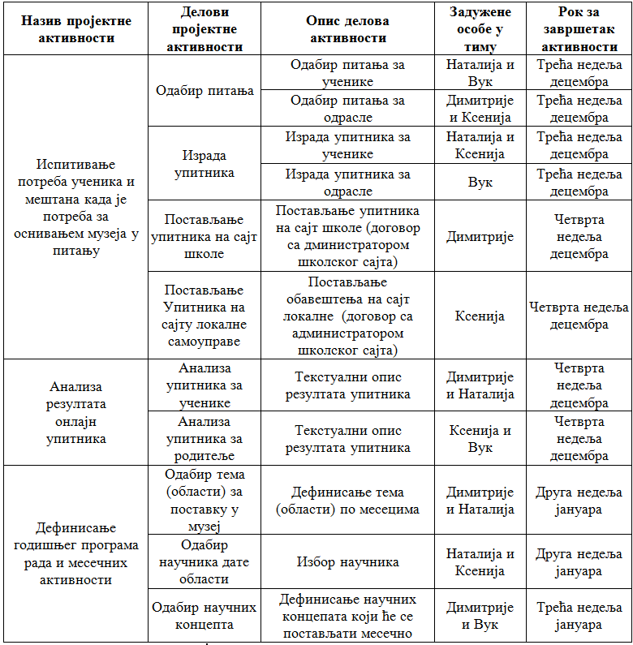

Рад на пројекту
================

Током овог  часа:

•	у оквиру тима дефинисаћете пројектне активности;

•	одредићете улоге у тиму, тачније одредићете ко ће у тиму да реализује коју од активности;

•	одредићете време за које ће свако реализовати своје активности, тачније одредићете временски оквир за реализацију планираних активности;

•	представићете резултате свим члановима тима. 

И оно што је најважније, даћете решење за тему коју сте обрадили. У нашем случају бавићемо се осмишљавањем активности за побољшање научно-културне сцене наше средине.

Када је реализација пројектних активности у питању, препоручујемо да са својим вршњацима тимски радиш у облаку. 
Сада, када сви имате адресе електронске поште, нема разлога да не искористите приступ апликацијама за сарадничку обраду текста, цртање, израду мултимедијалних презентација, али и простору за складиштење. Приступ документима сачуваним у облаку једноставан је и удобан – са било ког места и у било које време, са свог или неког другог дигиталног уређаја можеш да им приступаш и допринесеш пројектним резултатима. Немој да губиш из вида значај представљања резултата произашлих из реализованих пројектних активности. У сарадњи са администратором школског сајта, идеје и резултате пројектних активности промовишите на сајту школе. Интернет омогућава да се ваше идеје чују далеко и одјекну громогласно. Размотрите и могућност учешћа на националним и међународним конкурсима. Активан став грађанина 21. века нужност је на коју треба да се навикнемо и искористимо њен пун потенцијал.

**Дефинисање пројектних активности**

У оквиру тима ћете дефинисати пројектне активности, тачније потребно је да прецизно и квалитетно дефинишете активности које ћете као тим спровести како бисте реализовали пројекат на тему коју сте одабрали. 
Другим речима, пројектне активности представљају све активности које ћете спровести током реализацији вашег пројекта. Тако да сама успешност пројекта у великој мери зависи од добро испланираних и, касније, реализованих активности.
При планирању активности водите рачуна о очекиваним резултатима, односно за сваки очекивани резултат треба да осмислите бар једну активност и поделите је на мале, једноставне задатке. На пример, једна од активности може бити организовање презентације за наставнике и родитеље и неки од задатака који ће бити део ове активности су: закуп или резервација просторије у којој ће бити одржана презентација, израда позивница, слање позивница родитељима, наставницима, представницима локалне заједнице, и томе слично.
У пројектне активности потребно је уврстити све кораке који се морају направити како би ваш очекивани резултат био реализован. Наравно, није потребно улазити у најситније детаље и писати, на пример, „назвати Петра Петровића из Крагујевачких новина“ и томе слично.
Осим тога, важно је да представите тачан распоред активности и зависност једне активности од друге, односно узрочно-последичне везе између појединих активности. На пример, неке активности могу да се обављају паралелно, у истом временском периоду. Међутим, за неке активности је неопходно да се прво успешно заврши претходна активност. 

Пример дефинисаних пројектних активности за тему: **Школа је наша**.

**Oпис истраживачког задатка:** Како је школа део друштвене заједнице она као таква може да допринесе јачању научно-културне сцене.

**Циљ пројекта:** Креирање акција који доприносе јачању научно-културне сцене твог места.

Кроз доњу табелу ћемо демонстрирати како ћете дефинисати пројектне активности, и како ћете распоредити улоге у тиму и рок за завршетак планираних активности.

Представљање резултата истраживања публици (другарицама, друговима, наставницима) је добар начин да са другима поделите оно што сте научили. 

Потребно је да осмислите мултимедијалну презентацију, видео, анимацију или пано, како бисте представили резултата пројекта. Такође, потребно је да сачините план израде мултимедијалне презентације.
Презентација треба да садржи 10 – 12 слајдова укључујући: насловни слајд, увод са кратким описом пројекта, најмање три слајда са информацијама о теми истраживања, закључак који сумира главне идеје и процес реализације пројекта и слајд на коме наводите изворе информација које сте користили. 

Током осмишљавања презентације потребно је да осмислите и сценарио за усмену презентацију, као и да дефинишете улоге за сваког члана тима током презентовања.

Такође је драгоцено чути повратне информације публике о вашем раду. Ако их добро чујете, моћи ћете да процените шта је добро прошло, а шта сте могли да урадите боље. 

.. infonote::
 
    Сада је ред да ти и твоји другови и другарице:

    - у оквиру тима, дефинишете пројектне активности;
    - одредите улоге у тиму, тачније одредите ко ће у тиму да реализује сваку од активности;
    - одредите време за које ће свако реализовати своје активности, тачније одредите временски оквир за реализацију планираних активности;
    - представите резултате свим члановима тима;
    - направите план израде мултимедијалне презентације или паноа; 
    - осмислите сценарио за усмену презентацију.

    За реализацију ове фазе у пројекту можете користити документацију која је дата на следећем `линку <../_static/ProjektnaDokumentacija.docx>`_

